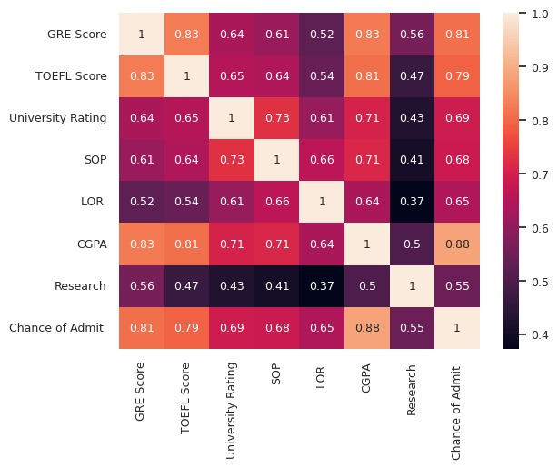
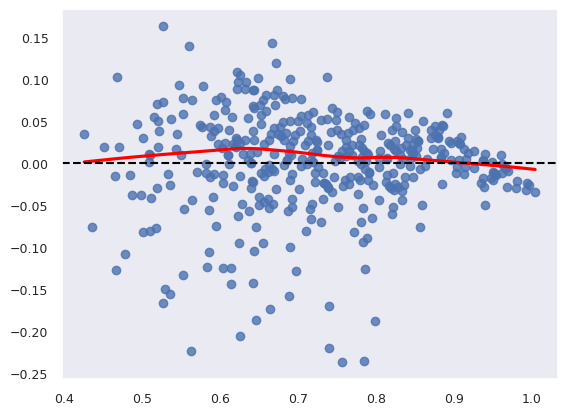
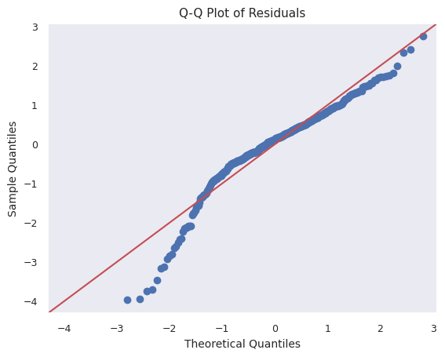
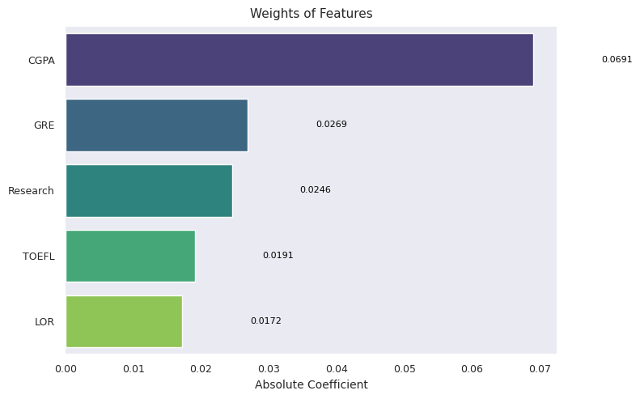

# 🎓 Jamboree Education — Graduate Admission Prediction

**Linear regression case study estimating a student's probability of graduate admission from academic and profile features, built to give Jamboree Education a data-driven counseling tool.**

[](https://www.linkedin.com/in/mr-tps/)
[](LICENSE)
[](https://colab.research.google.com/drive/1bxn1Eb43hsYnt1Y_dUXoQROBSfsprhDu?usp=sharing)
[](https://www.kaggle.com/code/tariniprasad0x/jamboree-education-linear-regression)

---

## Table of Contents

- [Problem Statement](#problem-statement)
- [Dataset](#dataset)
- [Methodology](#methodology)
- [Results](#results)
- [Key Insights](#key-insights)
- [Recommendations](#recommendations)
- [Repository Structure](#repository-structure)
- [Run It Yourself](#run-it-yourself)
- [Tech Stack](#tech-stack)
- [Future Work](#future-work)
- [License](#license)

---

## Problem Statement

Jamboree Education helps students applying to graduate programs abroad (GRE/TOEFL/SAT prep, application counseling). This project builds a model that estimates a student's **chance of admission (0–1)** from their academic profile, so that Jamboree can:

- Give applicants a reliable, quantified admission estimate
- Identify which profile factors actually move the needle
- Direct counseling effort (GRE prep, CGPA support, research guidance) to where it has the most impact
- Move from generic advice to a data-backed decision engine

## Dataset

400+ student records with the following features:

| Feature | Description |
|---|---|
| GRE Score | Out of 340 |
| TOEFL Score | Out of 120 |
| University Rating | Applicant's undergrad university rating, 1–5 |
| SOP | Statement of Purpose strength, 1–5 |
| LOR | Letter of Recommendation strength, 1–5 |
| CGPA | Undergraduate GPA, out of 10 |
| Research | Research experience (0 / 1) |
| **Chance of Admit** | **Target** — probability of admission, 0–1 |

No missing values or duplicates; outliers are minimal.

<p align="center">
  
  <br>
  <em>CGPA, GRE, and TOEFL are the most strongly correlated with admission chance; SOP and University Rating are noticeably weaker.</em>
</p>

## Methodology

1. **EDA** — univariate and bivariate analysis of all features against admission chance
2. **Preprocessing** — `StandardScaler` on continuous features (GRE, TOEFL, CGPA); ordinal features (SOP, LOR, University Rating) scaled but not encoded; `Research` left as-is (already binary)
3. **Modeling** — OLS via `statsmodels` for inference, plus `scikit-learn` Linear Regression, Lasso, Ridge, ElasticNet (including `*CV` variants) and polynomial regression, evaluated on R², adjusted R², RMSE, and MAE
4. **Feature selection** — dropped `University Rating` and `SOP` after they came back statistically insignificant (p > 0.05); re-trained model showed no drop in R², confirming they added no predictive value
5. **Assumption checks** — linearity (residual plots), multicollinearity (VIF), residual normality (Shapiro-Wilk, Q-Q plot), homoscedasticity (Goldfeld-Quandt test), autocorrelation (Durbin-Watson, Breusch-Godfrey)

## Results

**Model comparison** — all models tuned (CV for the regularized variants, degree-2 features for polynomial), evaluated on the same train/test split:

| Model | Train R² | Train Adj. R² | Train RMSE | Train MAE | Test R² | Test Adj. R² | Test RMSE | Test MAE |
|---|---|---|---|---|---|---|---|---|
| **Linear Regression** | 0.8211 | 0.8179 | 0.0594 | 0.0425 | 0.8188 | 0.8051 | 0.0609 | 0.0427 |
| LassoCV | 0.8210 | 0.8178 | 0.0594 | 0.0425 | 0.8189 | 0.8052 | 0.0609 | 0.0425 |
| RidgeCV | 0.8207 | 0.8175 | 0.0594 | 0.0425 | 0.8182 | 0.8043 | 0.0610 | 0.0428 |
| ElasticNetCV | 0.8210 | 0.8178 | 0.0594 | 0.0425 | 0.8189 | 0.8051 | 0.0609 | 0.0426 |
| Polynomial Regression (deg. 2) | 0.8232 | 0.8200 | 0.0590 | 0.0419 | 0.8175 | 0.8036 | 0.0611 | 0.0429 |
| Polynomial + Ridge | 0.8214 | 0.8182 | 0.0593 | 0.0425 | 0.8187 | 0.8049 | 0.0609 | 0.0428 |
| Polynomial + Lasso | 0.8210 | 0.8178 | 0.0594 | 0.0425 | 0.8189 | 0.8051 | 0.0609 | 0.0426 |
| Polynomial + ElasticNet | 0.8210 | 0.8178 | 0.0594 | 0.0425 | 0.8189 | 0.8051 | 0.0609 | 0.0426 |

Train and test performance are nearly identical for every model, indicating no meaningful overfitting. All optimally-tuned variants converge to essentially the same performance — regularization and polynomial expansion don't buy anything here, which confirms the relationship is genuinely linear and not capacity-limited. The plain **Linear Regression** model is used going forward since it matches the best regularized/polynomial results with no added complexity.

**Linear regression assumption checks:**

| Assumption | Result |
|---|---|
| Linearity | Holds — residuals show no systematic curve against fitted values or predictors |
| No multicollinearity | Holds — all VIF values below 5 |
| Homoscedasticity | Holds — Goldfeld-Quandt test fails to reject H₀ (p > 0.05) |
| No autocorrelation | Holds — Durbin-Watson and Breusch-Godfrey both fail to reject H₀ |
| Residual normality | **Violated** — Shapiro-Wilk rejects normality (p ≤ 0.05); residuals are left-skewed. This affects the validity of some statistical inference (e.g. confidence intervals) but not the point predictions themselves |

<p align="center">
  
  
  <br>
  <em>Left: residuals vs. predicted values — the near-flat Lowess line supports linearity. Right: Q-Q plot showing the left-skew that fails the normality assumption.</em>
</p>

## Key Insights

**Most important predictors** (by model coefficient and significance):

1. **CGPA** — strongest predictor by a clear margin (coefficient ≈ 0.068, p < 0.001)
2. **GRE Score** (coefficient ≈ 0.027, p < 0.001)
3. **Research Experience** (coefficient ≈ 0.024, p = 0.001)
4. **TOEFL Score**
5. **LOR Strength**

<p align="center">
  
  <br>
  <em>Standardized coefficients after dropping SOP and University Rating — CGPA dominates, followed by GRE and Research.</em>
</p>

**Low impact / dropped:** SOP strength and University Rating were not statistically significant once the other features were accounted for, and removing them left model performance unchanged.

## Recommendations

**For students**
- Prioritize CGPA — it's the single strongest lever on admission chance
- Invest seriously in GRE preparation
- Pursue research or internship experience where possible
- Secure strong letters of recommendation

**For Jamboree**
- Shift counseling resources away from SOP polishing toward academic prep and test scores, where the data shows the actual leverage
- Use the model as a scoring layer in the admission-chance feature, with a periodic retrain as new outcome data comes in
- Build personalized improvement roadmaps per student based on which factors are weakest relative to their target programs

## Repository Structure

```
├── Jamboree Education - Linear Regression.ipynb   # Main analysis: EDA, modeling, diagnostics (scikit-learn)
├── Spark_Linear_Regression_Jambooree.ipynb         # PySpark version of the modeling pipeline
├── Report _ Jamboree Education - Linear Regression.pdf / .docx   # Written report
├── Jamboree_Education_Linear_Regression.pdf        # Notebook export
├── assets/                                          # Plots referenced in this README
└── LICENSE
```

## Run It Yourself

Open directly in Colab — no local setup needed:

- **scikit-learn version:** [Open in Colab](https://colab.research.google.com/drive/1bxn1Eb43hsYnt1Y_dUXoQROBSfsprhDu?usp=sharing)
- **PySpark version:** [Open in Colab](https://colab.research.google.com/drive/1sHevpMgFE3mTjXnxAiMDmRMCeDc5v8Fn?usp=sharing)
- **Kaggle:** [View notebook](https://www.kaggle.com/code/tariniprasad0x/jamboree-education-linear-regression)

Or clone and run locally:

```bash
git clone https://github.com/tarini-py/Jamboree-Education-Linear-Regression.git
cd Jamboree-Education-Linear-Regression
pip install pandas numpy matplotlib seaborn scikit-learn statsmodels jupyter
jupyter notebook "Jamboree Education - Linear Regression.ipynb"
```

## Tech Stack

`Python` · `Pandas` · `NumPy` · `Matplotlib` / `Seaborn` · `scikit-learn` · `Statsmodels` · `PySpark` · `Jupyter`

## Future Work

- Add GRE section-wise scores (quant vs. verbal) instead of the composite
- Bring in work experience, internships, publications, and interview performance
- Add university ranking tiers and program-level historical admission rates
- Test non-linear models (Random Forest, XGBoost) as a performance ceiling check
- Retrain periodically against actual admission outcomes to track drift

## License

MIT — see [LICENSE](LICENSE).

---

**Author:** [Tarini Prasad Samantray](https://www.linkedin.com/in/mr-tps/)
