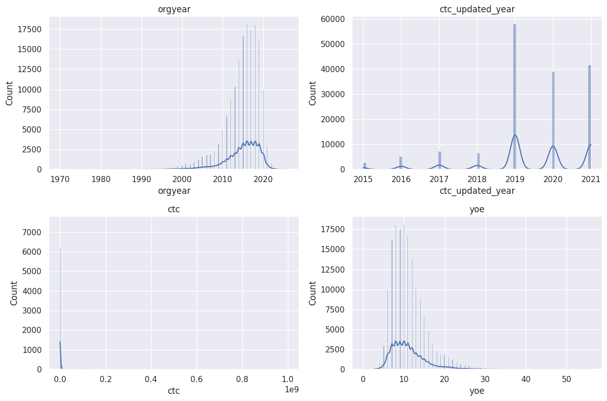
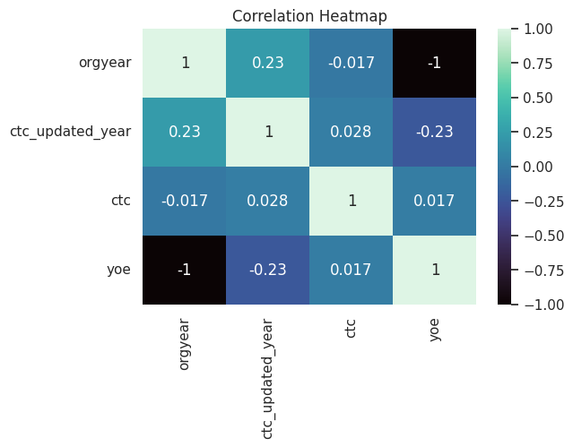
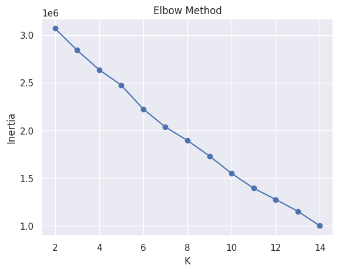
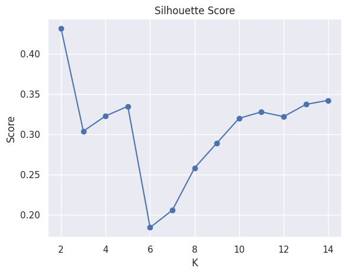
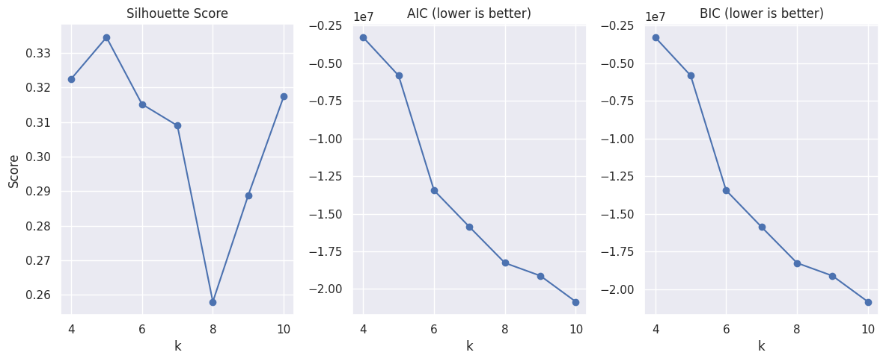
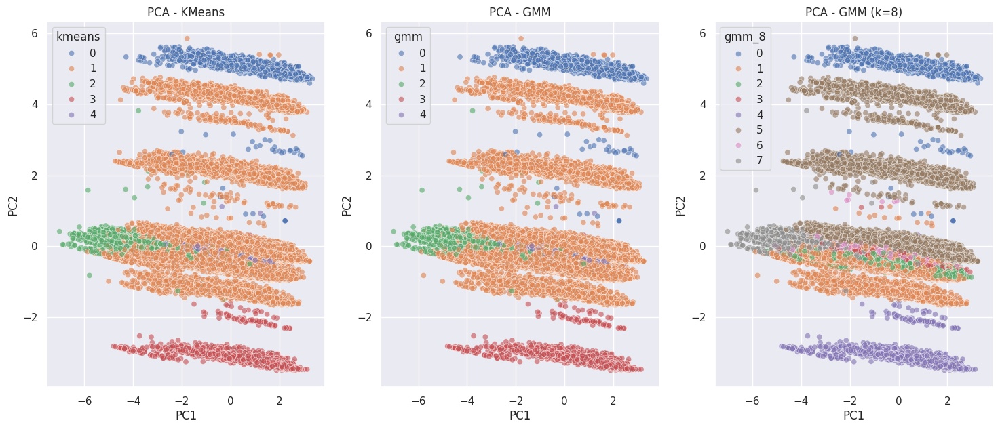
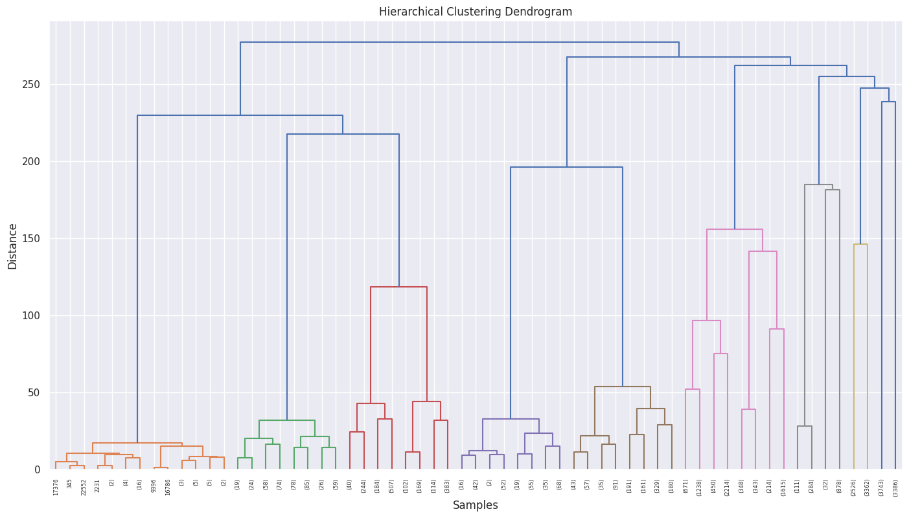
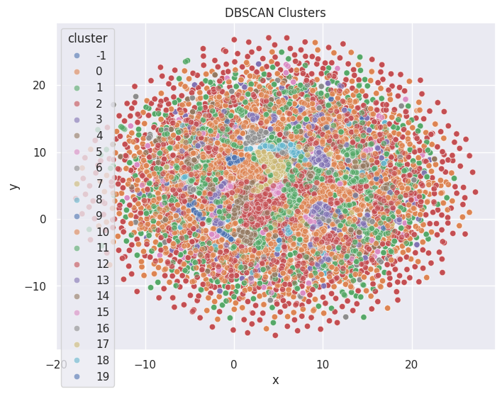

---

Part of the [DSML Business Case Studies](https://github.com/tarini-py/DSML-Business-Case-Studies) portfolio.

---

# Scaler Learner & Company Profiling — Unsupervised Clustering

[](https://www.linkedin.com/in/mr-tps/)

## 🚀 Run on Google Colab
[](https://colab.research.google.com/drive/1sBV8r9x4o0b1lFd4G8vVK_1eendGjIIO?usp=sharing)

## 📊 View on Kaggle
[](https://www.kaggle.com/code/tariniprasad0x/scaler-learner-company-profiling-clustering)

---


Segmenting **154,937 Scaler learners** by compensation, experience, role, and company using rule-based flags and four unsupervised clustering algorithms (KMeans, GMM, Hierarchical, DBSCAN) — to identify learner personas, benchmark companies, and surface actionable career-guidance and hiring-strategy insights.

---

## Table of Contents

- [Business Context](#business-context)
- [Dataset](#dataset)
- [Pipeline Overview](#pipeline-overview)
- [1. Data Cleaning & Preprocessing](#1-data-cleaning--preprocessing)
- [2. Exploratory Data Analysis](#2-exploratory-data-analysis)
- [3. Rule-Based Compensation Flags](#3-rule-based-compensation-flags)
- [4. Feature Engineering](#4-feature-engineering)
- [5. Clustering Models](#5-clustering-models)
- [6. Cross-Model Validation](#6-cross-model-validation)
- [7. Business Insights & Recommendations](#7-business-insights--recommendations)
- [8. Technical Notes & Caveats](#8-technical-notes--caveats)
- [9. Key Takeaway](#9-key-takeaway)
- [Tech Stack](#tech-stack)
- [Repository Structure](#repository-structure)

---

## Business Context

Scaler is an online tech-versity (a product of InterviewBit) offering live, mentor-led Computer Science and Data Science programs. This case study puts on the hat of a data scientist on Scaler's analytics team, tasked with **profiling the best companies and job positions** for learners from a snapshot of the learner database — clustering them by job profile, company, and compensation so that similar learners land in similar, interpretable groups.

## Dataset

The raw dataset (`scaler.csv`, downloaded via `gdown` from Google Drive) contains **205,843 records** across 7 columns:

| Column | Description |
|---|---|
| `company_hash` | Anonymized (hashed) employer identifier |
| `email_hash` | Anonymized (hashed) learner identifier |
| `orgyear` | Year the learner joined their current organization |
| `ctc` | Cost-to-company (annual compensation, in ₹) |
| `job_position` | Free-text job title (self-reported) |
| `ctc_updated_year` | Year the CTC figure was last updated |

`company_hash` and `email_hash` are one-way hashed strings — real company and learner identities are not recoverable from this dataset, which is why the notebook and this README report cluster-level statistics rather than named companies.

## Pipeline Overview

```
Raw CSV (205,843 rows)
   │
   ├─► Data Cleaning              → dedupe, fix job_position, filter invalid years/CTC
   ├─► EDA                        → distributions, outliers, correlations
   ├─► Rule-Based Flags           → Designation / Class / Tier (relative pay position)
   ├─► Feature Engineering        → role extraction, one-hot encoding, log-transform, scaling
   ├─► Dimensionality Reduction   → PCA, t-SNE, UMAP (for visualization)
   └─► Clustering                 → KMeans · GMM · Hierarchical · DBSCAN
                                        │
                                        └─► Learner Personas + Business Recommendations
```

---

## 1. Data Cleaning & Preprocessing

Initial data-quality audit found missing values in `company_hash` (44), `orgyear` (86), and `job_position` (52,548), plus records where the same learner appeared to hold multiple simultaneous jobs at the same company — a data-entry artifact rather than a real signal.

| Step | Rows Remaining | Rows Removed |
|---|---:|---:|
| Raw load | 205,843 | — |
| Drop redundant index column + 34 exact duplicate rows | 205,809 | 34 |
| Collapse duplicate `(email, company, orgyear)` records, keeping the most descriptive `job_position` | 160,497 | 45,312 |
| Filter invalid `orgyear` (kept range: 1970–2026) | 160,438 | 59 |
| Remove unrealistic low CTC (`ctc < ₹1.2L` **and** `yoe > 1`) | **154,937** | 5,501 |
| **Total removed** | | **50,906 (24.7%)** |

Key cleaning decisions:
- **String sanitization** — `company_hash` and `email_hash` were passed through a regex cleaner (`[^A-Za-z0-9 ]+`) to strip stray characters.
- **Job-position deduplication** — for learners with multiple rows under the same `(email_hash, company_hash, orgyear)`, the row with the most descriptive (longest, non-"Other") `job_position` was kept, resolving the "multiple jobs at the same company" anomaly.
- **Org-year validation** — years outside 1970–2026 (e.g., `20165`, `2101`, `83`) were identified as entry errors and dropped; `yoe` (years of experience) was then derived as `2026 − orgyear`.
- **CTC floor** — an IQR outlier scan flagged `ctc` as the noisiest numeric column (6.77% outlier rate). Rather than blanket outlier removal, a targeted rule was applied: **CTC below ₹1.2L is only valid for learners with ≤1 year of experience** (freshers/interns); the same low CTC with `yoe > 1` was treated as a data-entry error and dropped.

## 2. Exploratory Data Analysis

Distributions of the four core numeric fields (`orgyear`, `ctc_updated_year`, `ctc`, `yoe`) confirmed a right-skewed CTC distribution (median ₹9.7L vs. a mean pulled up by a long tail reaching ₹100 Cr+) and a learner base concentrated in the 6–13 years of experience band.



`orgyear` and `yoe` are, unsurprisingly, perfectly (inversely) correlated by construction (−1.0). More interestingly, `ctc` correlates only weakly with `yoe` (~0.09) — an early visual hint that **experience alone is a poor predictor of pay**, a pattern the clustering results confirm more rigorously later.



## 3. Rule-Based Compensation Flags

Before any ML clustering, three **relative pay-position flags** were engineered by comparing each learner's CTC to their peer-group average (flag = 3 if `ctc < 0.9×avg`, i.e. underpaid; 1 if `ctc > 1.1×avg`, i.e. overpaid/high-performer; 2 otherwise):

| Flag | Peer Group Used | Granularity |
|---|---|---|
| **Designation** | `company_hash` + `role_group` + `yoe` | Most granular (same company, role, and experience level) |
| **Class** | `company_hash` + `role_group` | Company + role |
| **Tier** | `company_hash` | Company-wide |

> **Note:** the notebook's own inline commentary describes `Designation` as a "global peer comparison." Based on the actual `groupby(['company_hash','role_group','yoe'])` used to compute it, it is in fact the **narrowest** peer group of the three (not a global/company-agnostic one) — `Tier` is the company-wide comparison. The table above reflects what the code computes.

**Distribution of flags** (154,937 learners):

| Value | Designation | Class | Tier |
|---|---:|---:|---:|
| 1 (overpaid / high performer) | 23,156 (14.9%) | 27,620 (17.8%) | 27,315 (17.6%) |
| 2 (average) | 88,070 (56.8%) | 56,449 (36.4%) | 40,292 (26.0%) |
| 3 (underpaid) | 43,711 (28.2%) | 70,868 (45.7%) | 87,330 (56.4%) |

Cross-tabulating the three flags surfaced the **most vulnerable learner segment**: those who are simultaneously underpaid relative to their narrow peer group, their role within the company, *and* the company overall — a compounding disadvantage rather than an isolated one. Conversely, top performers (Designation = 1) overwhelmingly also land in Class = 1 and Tier = 1, indicating **high performers are consistently rewarded across all three lenses**, not just favored by one comparison.

## 4. Feature Engineering

**Role extraction** — the raw `job_position` field contained **922 unique free-text values** (e.g., "Senior Software Engineer (Backend)", "full stack devloper", "Member of Technical Staff at Nineleaps"). These were lowercased, regex-cleaned, and mapped via keyword rules into 11 `role_group` categories (`backend`, `frontend`, `fullstack`, `data`, `mobile`, `devops`, `analyst`, `management`, `engineering`, `chief`, `other`), alongside 15 binary indicator flags (`is_backend`, `is_senior`, `is_manager`, `is_intern`, etc.).

**Final model matrix** — built from `ctc`, `yoe`, `last_ctc_update` (recency of CTC data), the three pay-position flags, 5 retained boolean role/seniority indicators, and one-hot encoded `role_group`:

1. Started at **27 columns** after one-hot encoding `role_group` (11 categories → 10 dummies via `drop_first=True`).
2. Dropped **6 boolean role flags** (`is_backend`, `is_frontend`, `is_fullstack`, `is_data`, `is_devops`, `is_mobile`) that were highly correlated with their corresponding `role_group_*` one-hot columns, leaving **21 features**.
3. Applied `np.log1p()` to `ctc` to tame its heavy right skew.
4. Standardized all 21 features with `StandardScaler`.

This 21-feature, standardized matrix (`X`) is the common input to every clustering algorithm below.

---

## 5. Clustering Models

Four algorithms were applied to the same feature matrix to cross-validate segment structure from different angles.

### 5.1 KMeans

**Model selection** — silhouette score and inertia were computed for k = 2–14. k=2 produced the numerically highest silhouette score but only a coarse, low-information split; k=14 fragmented the data into many small, hard-to-interpret micro-clusters. **k=5** was selected as the practical balance between cluster quality and business interpretability.

<p float="left">
  
  
</p>

**Final model:** `KMeans(n_clusters=5, random_state=42)` → **silhouette score ≈ 0.335**, indicating moderate cluster separation (expected for real-world career data, where segments naturally overlap).

| Cluster | Persona | Avg CTC | Avg YOE | Avg Tier | Size |
|---|---|---:|---:|---:|---:|
| 0 | Mid-Level Stable | 22.1 LPA | 7.4 | 2.45 | 2,469 (1.6%) |
| 1 | Senior but Stagnating | 24.5 LPA | 10.8 | 2.42 | **137,006 (88.4%)** |
| 2 | Veteran Underpaid | 42.6 LPA | 16.9 | 1.75 | 8,684 (5.6%) |
| 3 | Elite High Performer | 45.4 LPA | 10.0 | 2.63 | 2,603 (1.7%) |
| 4 | Experienced but Underpaid | 16.8 LPA | 12.9 | 2.40 | 4,175 (2.7%) |

*(Tier is on a 1–3 scale where 1 = high earner within company, 3 = low earner within company.)*

**Interpretation:**
- **Experience ≠ salary** — Clusters 2 and 4 both carry high experience (13–17 yrs) but sit at opposite compensation extremes, confirming company and role matter more than tenure alone.
- **Company tier drives pay** — Cluster 3 out-earns Cluster 2 despite ~7 fewer years of experience, because it sits in higher `Tier` companies.
- Clusters 1 and 4 together represent real underpaid-relative-to-experience segments — a "market inefficiency" signal worth acting on.

### 5.2 Gaussian Mixture Models

**GMM (k=5)** on the same matrix produced almost the *exact same* assignment as KMeans — only **4 of 154,937 labels (0.003%)** differed — a strong cross-algorithm validation of the 5-cluster structure.

**GMM (k=8)** was then explored to see if a softer, probabilistic model could recover finer sub-structure. Silhouette, AIC, and BIC were tracked across k = 4–10:



| k | Silhouette | AIC | BIC |
|---:|---:|---:|---:|
| 4 | 0.3225 | −3,283,295 | −3,273,234 |
| **5** | **0.3345** | −5,824,003 | −5,811,426 |
| 6 | 0.3152 | −13,445,835 | −13,430,740 |
| 7 | 0.3090 | −15,879,831 | −15,862,218 |
| **8** | **0.2580** | −18,269,721 | −18,249,591 |
| 9 | 0.2888 | −19,124,449 | −19,101,801 |
| 10 | 0.3174 | −20,847,876 | −20,822,711 |

At k=8, GMM revealed 8 finer personas layered inside the 5 KMeans macro-segments — most notably splitting the dominant mid-salary band into three distinct sub-groups by experience level:

| Persona | Avg CTC | Avg YOE | Size |
|---|---:|---:|---:|
| Elite High Performers | 45.4 LPA | 10.0 | 2,603 (1.7%) |
| Veteran Underpaid | 42.2 LPA | 16.9 | 8,680 (5.6%) |
| Well-Paid Mid Seniors | 30.8 LPA | 10.4 | 54,120 (34.9%) |
| Mid-Level Stable | 22.1 LPA | 7.4 | 2,469 (1.6%) |
| Experienced but Slightly Underpaid | 21.1 LPA | 11.3 | 47,104 (30.4%) |
| Mid-Level Average | 19.4 LPA | 10.1 | 23,445 (15.1%) |
| Experienced with Underpaid | 19.3 LPA | 11.3 | 9,217 (5.9%) |
| Experienced Low Earners | 17.2 LPA | 12.2 | 7,299 (4.7%) |

The PCA projection below compares all three cluster assignments side by side:



### 5.3 Hierarchical (Agglomerative) Clustering

Run on a **25,000-row random sample** (Ward linkage requires pairwise distance computation, making it impractical at the full 154,937-row scale). A dendrogram (truncated to 5 levels) guided the choice of **k=8**:



| Cluster | Avg CTC | Avg YOE | Avg Class | Avg Tier |
|---|---:|---:|---:|---:|
| 0 | 11.2 LPA | 10.5 | 2.33 | 2.56 |
| 1 | 15.0 LPA | 12.5 | 2.09 | 2.29 |
| 2 | 31.8 LPA | 16.9 | 2.09 | 1.74 |
| 3 | 45.7 LPA | 10.2 | 2.41 | 2.51 |
| 4 | 26.0 LPA | 10.9 | 2.22 | 2.35 |
| 5 | 16.5 LPA | 11.1 | 2.30 | 2.39 |
| 6 | 13.5 LPA | 10.1 | 2.26 | 2.42 |
| 7 | 11.8 LPA | 11.4 | 2.15 | 2.40 |

Clusters 2 and 3 cleanly reproduce the "Veteran Underpaid" and "Elite High Performer" anchors seen in KMeans and GMM. The remaining mid/low-salary clusters (0, 1, 5, 6, 7), however, show overlapping CTC and experience ranges with no strong distinguishing feature — the algorithm **over-segments** this band, likely compounded by the reduced sample size rather than genuine structure in the data.

### 5.4 DBSCAN

Run on a 10-component PCA projection of the full feature matrix. A k-distance graph (k=5 neighbors) was used to select `eps=0.6` (with `min_samples=10`):



DBSCAN found **19 density-based clusters plus a noise set**, ranging from a small ultra-high-earner segment down to broad mid-salary clusters:

| Cluster | Avg CTC | Avg YOE | Size |
|---|---:|---:|---:|
| −1 (noise) | 277.6 LPA (~₹2.78 Cr) | 18.7 | 775 (0.5%) |
| 9 | 45.5 LPA | 9.8 | 2,468 (1.6%) |
| 7 | 37.5 LPA | 17.4 | 6,768 (4.4%) |
| 2 | 34.2 LPA | 10.0 | 38,557 (24.9%) |
| 6 | 32.1 LPA | 9.9 | 4,806 (3.1%) |
| 0 | 20.8 LPA | 11.1 | 37,255 (24.0%) |
| 1 | 19.2 LPA | 10.0 | 23,417 (15.1%) |
| *(11 smaller clusters, 2–17 LPA range)* | | | remainder |

DBSCAN's density-based approach correctly **isolated extreme outliers** as noise — the −1 cluster averages ~₹2.78 Cr CTC, nearly 6× the next-highest cluster — while mid-level professionals splintered into many small, weakly-separated clusters, indicating **no strong density-based grouping exists** in that band. This independently supports the same "continuous, not discrete" conclusion drawn from the hierarchical clustering results.

---

## 6. Cross-Model Validation

Two personas emerge consistently across **all four** algorithms, which is a meaningful robustness signal:

| Persona | KMeans | GMM(5) | GMM(8) | Hierarchical | DBSCAN |
|---|---|---|---|---|---|
| **Elite High Performer** | ✅ ~45.4 LPA, 10.0 YOE | ✅ (same) | ✅ ~45.4 LPA | ✅ ~45.7 LPA, 10.2 YOE | ✅ ~45.5 LPA, 9.8 YOE |
| **Veteran Underpaid** | ✅ ~42.6 LPA, 16.9 YOE | ✅ (same) | ✅ ~42.2 LPA | ✅ ~31.8 LPA, 16.9 YOE | ✅ ~37.5 LPA, 17.4 YOE |

Both segments are small (2–6% of learners each) but **algorithm-independent** — every method, whether centroid-based, probabilistic, connectivity-based, or density-based, isolates the same high-tenure/low-relative-pay group and the same high-pay/moderate-tenure elite group. The much larger mid-salary population, by contrast, is where every method disagrees on where to draw boundaries — itself a finding (see [Key Takeaway](#9-key-takeaway)).

## 7. Business Insights & Recommendations

**Learner-level personas:**

| Segment | Profile | Recommendation |
|---|---|---|
| Elite Earners | ~40–45 LPA, 8–10 YOE, top companies | Feature as mentors / success stories in marketing; deepen partnerships with their employers |
| Underpaid Experienced | 15–17 YOE, low `Tier` | Target with upskilling + transition programs; promote "switch to high-paying roles" tracks |
| Mid-Level (largest group) | 8–12 YOE, 10–25 LPA, continuous distribution | Personalized learning paths; specialization tracks (Backend, Data Science, DevOps, Data Engineering, Cybersecurity) |
| Entry-Level / Low Earners | <10–12 LPA, early career | Beginner-focused + placement-driven programs; resume building, mock interviews, mentorship |

**Company-level:** high-average-CTC / high-Tier-1-share companies are candidates for prioritized recruiting partnerships and "top companies to work for" marketing placements; low-paying, high-Tier-3-share companies are framed as **career-switch opportunities** for their employees.

**Role-level:** Backend, Data Science, and Fullstack roles command the highest pay — a signal to weight curriculum and marketing toward these tracks — while Support, Testing, and non-technical roles skew lower, suggesting value in building explicit **transition pathways** from these roles into backend/data/devops tracks.

## 8. Technical Notes & Caveats

Documented transparently for anyone extending this analysis:

- **k=5 cluster imbalance.** The headline KMeans/GMM(5) result places **88.4% of all learners into a single cluster** ("Senior but Stagnating"). The other four clusters (1.6–5.6% each) are where nearly all of the segmentation signal lives. This isn't a modeling error — it's consistent with the GMM(8) and DBSCAN results, which both show the same pattern of a few small, well-separated extreme segments sitting on top of one large, continuously-distributed mid-salary population. Treat the 5-persona table as "distinct outlier segments + one large residual group," not five equally-sized personas.
- **GMM(k=8) silhouette discrepancy.** The notebook's inline commentary states that k=8 achieves "slightly higher" silhouette than k=5. The computed values show the opposite: k=5 scores **0.3345** vs. k=8's **0.2580** — k=8 was likely chosen for its continued AIC/BIC improvement (both keep decreasing through k=10) and its finer-grained, more business-legible personas, not because of silhouette. The AIC/BIC vs. silhouette trade-off is worth being explicit about if this notebook is extended.
- **`Designation` naming.** As noted in [Section 3](#3-rule-based-compensation-flags), the flag documented as a "global" comparison is actually the most granular peer group (company + role + YOE), not a company-agnostic one.
- **Hierarchical clustering ran on a 25,000-row sample** (not the full 154,937), due to the O(n²) memory cost of `scipy`'s Ward linkage. Its mid-band over-segmentation should be read with that caveat in mind.
- **`company_hash` / `email_hash` are irreversibly hashed** — this analysis can rank and profile companies/learners at the cluster level but cannot name them.

## 9. Key Takeaway

> **Career growth is continuous rather than clustered** — so personalized progression strategies will outperform rigid segmentation.

Every clustering method — centroid-based (KMeans), probabilistic (GMM), connectivity-based (Hierarchical), and density-based (DBSCAN) — converges on the same structural story: a **small number of genuinely distinct extreme segments** (elite performers, veteran-underpaid professionals, ultra-high earners) sit on top of a **large, continuously-varying mid-market population** that resists clean boundaries. For Scaler, that argues for combining targeted interventions for the identifiable extremes with continuous, personalized guidance — rather than a one-size-fits-all persona — for the majority.

---

## Tech Stack

| Category | Libraries |
|---|---|
| Data handling | `pandas`, `numpy`, `re` |
| Visualization | `matplotlib`, `seaborn`, `plotly` |
| Dimensionality reduction | `scikit-learn` (`PCA`), `sklearn.manifold.TSNE`, `umap-learn` |
| Clustering | `sklearn.cluster.KMeans`, `sklearn.mixture.GaussianMixture`, `sklearn.cluster.AgglomerativeClustering`, `sklearn.cluster.DBSCAN`, `scipy.cluster.hierarchy` |
| Preprocessing | `sklearn.preprocessing.StandardScaler`, `sklearn.neighbors.NearestNeighbors` |
| Evaluation | `sklearn.metrics.silhouette_score` |

## Repository Structure

```
├── README.md
└── images/
    ├── eda_feature_distributions.png
    ├── eda_correlation_heatmap.png
    ├── kmeans_elbow_method.png
    ├── kmeans_silhouette_scores.png
    ├── gmm_model_selection.png
    ├── pca_cluster_comparison.png
    ├── hierarchical_dendrogram.png
    └── dbscan_clusters_umap.png
```

The full analysis notebook (`Scaler_Learner_Company_Profiling_Clustering.ipynb`) is linked via the **Open in Colab** badge at the top of this README.
